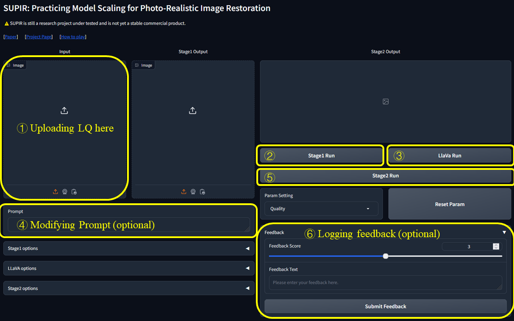
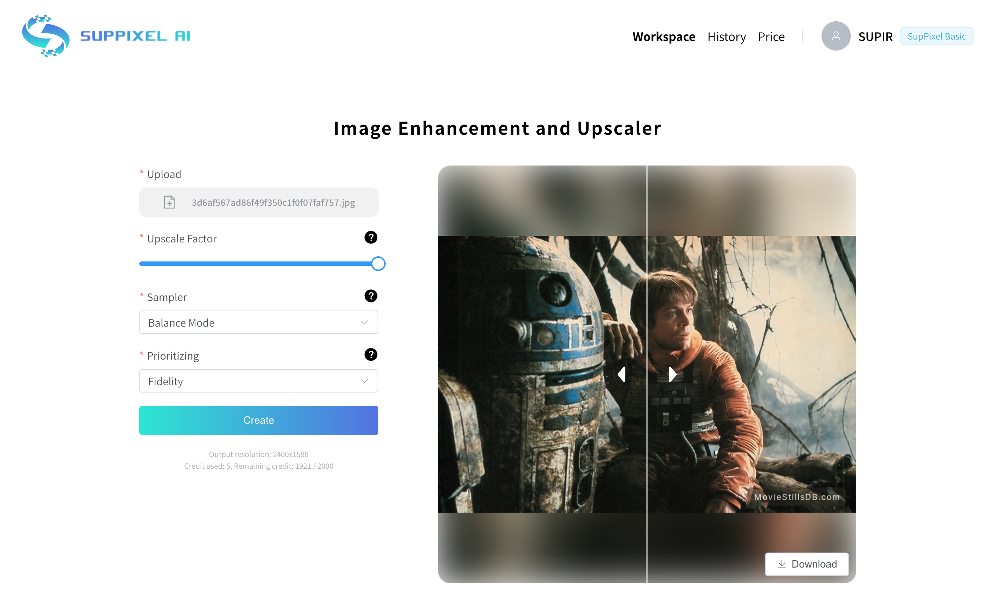

## (CVPR2024) Scaling Up to Excellence: Practicing Model Scaling for Photo-Realistic Image Restoration In the Wild

> [[Paper](https://arxiv.org/abs/2401.13627)] &emsp; [[Project Page](http://supir.xpixel.group/)] &emsp; [[Online App]](https://supir.suppixel.ai/home) <br>
> Fanghua, Yu, [Jinjin Gu](https://www.jasongt.com/), Zheyuan Li, Jinfan Hu, Xiangtao Kong, [Xintao Wang](https://xinntao.github.io/), [Jingwen He](https://scholar.google.com.hk/citations?user=GUxrycUAAAAJ), [Yu Qiao](https://scholar.google.com.hk/citations?user=gFtI-8QAAAAJ), [Chao Dong](https://scholar.google.com.hk/citations?user=OSDCB0UAAAAJ) <br>
> Shenzhen Institute of Advanced Technology; Shanghai AI Laboratory; University of Sydney; The Hong Kong Polytechnic University; ARC Lab, Tencent PCG; The Chinese University of Hong Kong <br>


<p align="center">
  
</p>

---
#### 🚀 We're thrilled to announce the official launch of SupPixel AI! Experience the next level of image processing and upscaling with our cutting-edge AI technology based on SUPIR. Explore now at [suppixel.ai](https://supir.suppixel.ai/home).

---
## 🔧 Dependencies and Installation

1. Clone repo
    ```bash
    git clone https://github.com/Fanghua-Yu/SUPIR.git
    cd SUPIR
    ```

2. Install dependent packages
    ```bash
    conda create -n SUPIR python=3.8 -y
    conda activate SUPIR
    pip install --upgrade pip
    pip install -r requirements.txt
    ```

3. Download Checkpoints

For users who can connect to huggingface, please setting `LLAVA_CLIP_PATH, SDXL_CLIP1_PATH, SDXL_CLIP2_CKPT_PTH` in `CKPT_PTH.py` as `None`. These CLIPs will be downloaded automatically. 

#### Dependent Models
* [SDXL CLIP Encoder-1](https://huggingface.co/openai/clip-vit-large-patch14)
* [SDXL CLIP Encoder-2](https://huggingface.co/laion/CLIP-ViT-bigG-14-laion2B-39B-b160k)
* [SDXL base 1.0_0.9vae](https://huggingface.co/stabilityai/stable-diffusion-xl-base-1.0/blob/main/sd_xl_base_1.0_0.9vae.safetensors)
* [LLaVA CLIP](https://huggingface.co/openai/clip-vit-large-patch14-336)
* [LLaVA v1.5 13B](https://huggingface.co/liuhaotian/llava-v1.5-13b)
* (optional) [Juggernaut-XL_v9_RunDiffusionPhoto_v2](https://huggingface.co/RunDiffusion/Juggernaut-XL-v9/blob/main/Juggernaut-XL_v9_RunDiffusionPhoto_v2.safetensors)
  * Replacement of `SDXL base 1.0_0.9vae` for Photo Realistic
* (optional) [Juggernaut_RunDiffusionPhoto2_Lightning_4Steps](https://huggingface.co/RunDiffusion/Juggernaut-XL-Lightning/blob/main/Juggernaut_RunDiffusionPhoto2_Lightning_4Steps.safetensors)
  * Distilling model used in `SUPIR_v0_Juggernautv9_lightning.yaml`


#### Models we provided:
* `SUPIR-v0Q`: [Baidu Netdisk](https://pan.baidu.com/s/1lnefCZhBTeDWijqbj1jIyw?pwd=pjq6), [Google Drive](https://drive.google.com/drive/folders/1yELzm5SvAi9e7kPcO_jPp2XkTs4vK6aR?usp=sharing)
    
    Default training settings with paper. High generalization and high image quality in most cases.

* `SUPIR-v0F`: [Baidu Netdisk](https://pan.baidu.com/s/1AECN8NjiVuE3hvO8o-Ua6A?pwd=k2uz), [Google Drive](https://drive.google.com/drive/folders/1yELzm5SvAi9e7kPcO_jPp2XkTs4vK6aR?usp=sharing)

    Training with light degradation settings. Stage1 encoder of `SUPIR-v0F` remains more details when facing light degradations.

4. Edit Custom Path for Checkpoints
    ```
    * [CKPT_PTH.py] --> LLAVA_CLIP_PATH, LLAVA_MODEL_PATH, SDXL_CLIP1_PATH, SDXL_CLIP2_CACHE_DIR 
    * [options/SUPIR_v0.yaml] --> SDXL_CKPT, SUPIR_CKPT_Q, SUPIR_CKPT_F
    ```
---

## ⚡ Quick Inference
### Val Dataset
RealPhoto60: [Baidu Netdisk](https://pan.baidu.com/s/1CJKsPGtyfs8QEVCQ97voBA?pwd=aocg), [Google Drive](https://drive.google.com/drive/folders/1yELzm5SvAi9e7kPcO_jPp2XkTs4vK6aR?usp=sharing)

### Usage of SUPIR
```Shell
Usage: 
-- python test.py [options] 
-- python gradio_demo.py [interactive options]

--img_dir                Input folder.
--save_dir               Output folder.
--upscale                Upsampling ratio of given inputs. Default: 1
--SUPIR_sign             Model selection. Default: 'Q'; Options: ['F', 'Q']
--seed                   Random seed. Default: 1234
--min_size               Minimum resolution of output images. Default: 1024
--edm_steps              Numb of steps for EDM Sampling Scheduler. Default: 50
--s_stage1               Control Strength of Stage1. Default: -1 (negative means invalid)
--s_churn                Original hy-param of EDM. Default: 5
--s_noise                Original hy-param of EDM. Default: 1.003
--s_cfg                  Classifier-free guidance scale for prompts. Default: 7.5
--s_stage2               Control Strength of Stage2. Default: 1.0
--num_samples            Number of samples for each input. Default: 1
--a_prompt               Additive positive prompt for all inputs. 
    Default: 'Cinematic, High Contrast, highly detailed, taken using a Canon EOS R camera, 
    hyper detailed photo - realistic maximum detail, 32k, Color Grading, ultra HD, extreme
     meticulous detailing, skin pore detailing, hyper sharpness, perfect without deformations.'
--n_prompt               Fixed negative prompt for all inputs. 
    Default: 'painting, oil painting, illustration, drawing, art, sketch, oil painting, 
    cartoon, CG Style, 3D render, unreal engine, blurring, dirty, messy, worst quality, 
    low quality, frames, watermark, signature, jpeg artifacts, deformed, lowres, over-smooth'
--color_fix_type         Color Fixing Type. Default: 'Wavelet'; Options: ['None', 'AdaIn', 'Wavelet']
--linear_CFG             Linearly (with sigma) increase CFG from 'spt_linear_CFG' to s_cfg. Default: False
--linear_s_stage2        Linearly (with sigma) increase s_stage2 from 'spt_linear_s_stage2' to s_stage2. Default: False
--spt_linear_CFG         Start point of linearly increasing CFG. Default: 1.0
--spt_linear_s_stage2    Start point of linearly increasing s_stage2. Default: 0.0
--ae_dtype               Inference data type of AutoEncoder. Default: 'bf16'; Options: ['fp32', 'bf16']
--diff_dtype             Inference data type of Diffusion. Default: 'fp16'; Options: ['fp32', 'fp16', 'bf16']
```

### Python Script
```Shell
# Seek for best quality for most cases
CUDA_VISIBLE_DEVICES=0,1 python test.py --img_dir '/opt/data/private/LV_Dataset/DiffGLV-Test-All/RealPhoto60/LQ' --save_dir ./results-Q --SUPIR_sign Q --upscale 2
# for light degradation and high fidelity
CUDA_VISIBLE_DEVICES=0,1 python test.py --img_dir '/opt/data/private/LV_Dataset/DiffGLV-Test-All/RealPhoto60/LQ' --save_dir ./results-F --SUPIR_sign F --upscale 2 --s_cfg 4.0 --linear_CFG
```

### Gradio Demo
```Shell
CUDA_VISIBLE_DEVICES=0,1 python gradio_demo.py --ip 0.0.0.0 --port 6688 --use_image_slider --log_history

# Juggernaut_RunDiffusionPhoto2_Lightning_4Steps and DPM++ M2 SDE Karras for fast sampling
CUDA_VISIBLE_DEVICES=0,1 python gradio_demo.py --ip 0.0.0.0 --port 6688 --use_image_slider --log_history --opt options/SUPIR_v0_Juggernautv9_lightning.yaml

# less VRAM & slower (12G for Diffusion, 16G for LLaVA)
CUDA_VISIBLE_DEVICES=0,1 python gradio_demo.py --ip 0.0.0.0 --port 6688 --use_image_slider --log_history --loading_half_params --use_tile_vae --load_8bit_llava
```
<p align="center">
  
</p>


### Online App

We've just launched [SupPixel AI](https://supir.suppixel.ai/home), an easy-to-use tool designed to help with high-quality image processing and upscaling. It builds on SUPIR. Whether you’re into photography, digital art, or just love playing around with image enhancement, we’d love for you to check it out.~

<p align="center">
  
</p>


---

## BibTeX
    @misc{yu2024scaling,
      title={Scaling Up to Excellence: Practicing Model Scaling for Photo-Realistic Image Restoration In the Wild}, 
      author={Fanghua Yu and Jinjin Gu and Zheyuan Li and Jinfan Hu and Xiangtao Kong and Xintao Wang and Jingwen He and Yu Qiao and Chao Dong},
      year={2024},
      eprint={2401.13627},
      archivePrefix={arXiv},
      primaryClass={cs.CV}
    }

---

## 📧 Contact
If you have any question, please email `fanghuayu96@gmail.com` or `jinjin.gu@suppixel.ai`.

---
## Non-Commercial Use Only Declaration
The SUPIR ("Software") is made available for use, reproduction, and distribution strictly for non-commercial purposes. For the purposes of this declaration, "non-commercial" is defined as not primarily intended for or directed towards commercial advantage or monetary compensation.

By using, reproducing, or distributing the Software, you agree to abide by this restriction and not to use the Software for any commercial purposes without obtaining prior written permission from Dr. Jinjin Gu.

This declaration does not in any way limit the rights under any open source license that may apply to the Software; it solely adds a condition that the Software shall not be used for commercial purposes.

IN NO EVENT SHALL THE AUTHORS OR COPYRIGHT HOLDERS BE LIABLE FOR ANY CLAIM, DAMAGES OR OTHER LIABILITY, WHETHER IN AN ACTION OF CONTRACT, TORT OR OTHERWISE, ARISING FROM, OUT OF OR IN CONNECTION WITH THE SOFTWARE OR THE USE OR OTHER DEALINGS IN THE SOFTWARE.

For inquiries or to obtain permission for commercial use, please contact Dr. Jinjin Gu (jinjin.gu@suppixel.ai).
